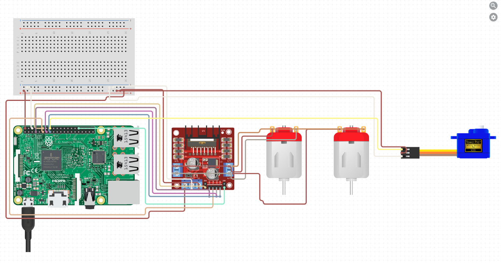

# Waste Classification

- Combining Neural network models trained on 4 different categories of waste. Aluminium, Paper, Plastic, Organic. With the Raspberry Pi 3b+, which actuates multiple motors based on it's classification.

  

## Models include

- Pre-trained MobileNetV2 model using transfer learning
- Model created from scratch using two dropout and dense layers
